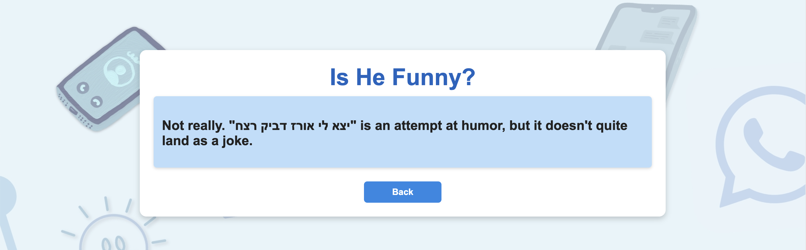
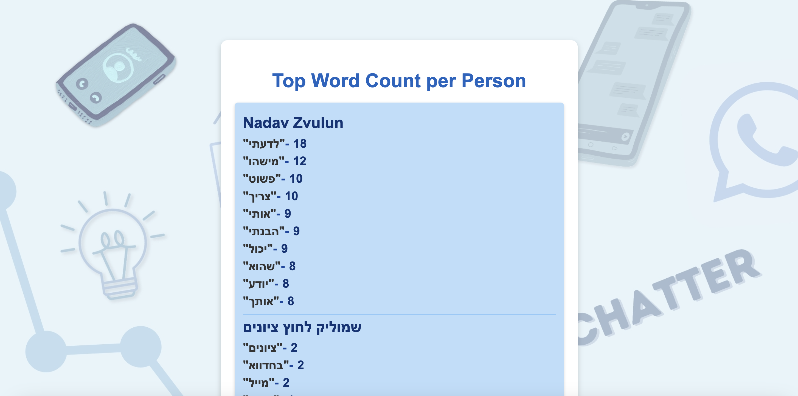
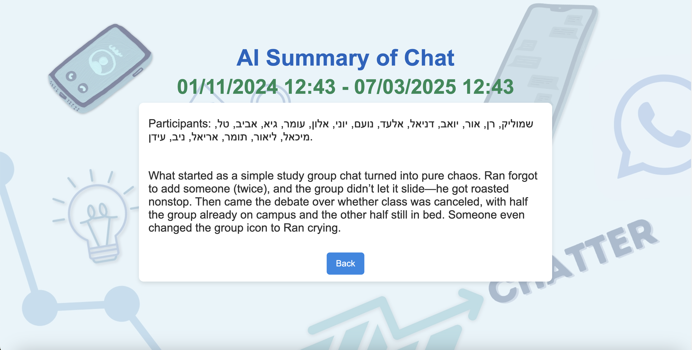

# Chatter

The website app recieves a ZIP-file extracted from any whatsapp chat and analyses its data for each participant of the group.

## Features:
### Chat Analysis📊
- Extracts **insights** from WhatsApp chats.
- **Summarizes conversations** using AI.
- Identifies the **busiest week** in the chat.

### Fun AI-Based Insights🎭
- Determines **who is funny** based on messages.
- Helps **settle arguments** by analyzing conversations.

### Participant Breakdown🔍
- Tracks **each participant's** most used words.
- Shows **when they are most active**.
- Counts the **total messages sent** by each user.

## Technologies Used: 🛠️
- Python & Pandas library
- Flask web-framework
- HTML, CSS

### How it works
1. **User Uploads a WhatsApp Chat**  
   - The user exports a **ZIP file** from WhatsApp and uploads it to the website.  

2. **Client-Side Processing**  
   - The ZIP file is **extracted** in the browser.  
   - The **chat text file** inside is opened, and the raw text is sent to the backend.  

3. **Backend Processing (Flask & Pandas)**  
   - The raw chat text is **converted into a Pandas DataFrame**, with each row representing a message.  
   - Special characters and irrelevant data are cleaned.  

4. **Data Analysis & AI Insights**  
   - The processed DataFrame is ready for analysis.  
   - Insights are generated based on **user requests** (e.g., participant activity, chat analysis, favorite words).
   - AI requests are handled using Groq API and carefully designed prompts for accurate responses.

## Usage:
### Option 1- Local:
1. Download the repository.
2. Install requirements.txt.
3. Remove # from row 6.
4. Add .env to project folder with GROQ_API_KEY = 'api-key'.
5. Run app.py file.
6. Open http://127.0.0.1:5001.
7. Further instructions are on the website on the bottom.

### Option 2:
**For easy access but small chats**
Visit the url: https://chatter-8sg6.onrender.com

## Images:

