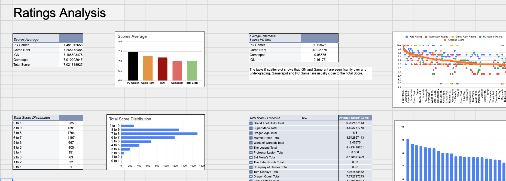
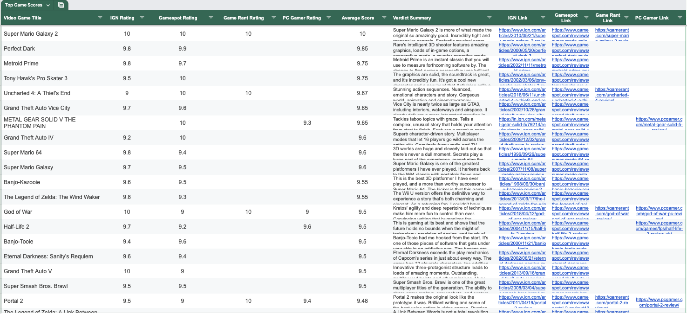

# Verdicator
Verdicator scrapes verdicts and ratings from multiple gaming websites, builds a local database, and visualizes the data in a clean GUI.

## Features:
 - Scrapes and aggregates critic scores.
 - Summarizes review texts into concise verdicts.
 - Visualizes data in an interactive GUI.

## Data Sources:
 - IGN  
 - Gamespot  
 - Game Rant  
 - PC Gamer  
 
 ## Technologies Used 🛠️
 - Python & Pandas for data processing and ETL
 - Selenium & BeautifulSoup for web scraping
 - customtkinter for GUI
 - NLP
 - SQLite for local database
 
 ## Usage:
 ### Check Out the Database and Analyzations:
  - Open the Google Sheets File: [Click Me!](https://docs.google.com/spreadsheets/d/1sAq6FAdMsJRqQo9VkkjWLPuCRXlZLemuqiwAgIr5z4Q/edit?usp=sharing)
 
 ### Run the app!
 #### Options:
 - Run "Verdicator.py" and enjoy.
 - [Download](https://www.dropbox.com/scl/fi/3nxajug4bkhafd8eyrs3z/Verdicator.zip?rlkey=zx7mb0kyf72dbw06ofjk2q5fx&st=mob6fpyh&dl=0) Verdicator's standalone app!  (Mac only).
 ## Images:
 
 
 
 

 
