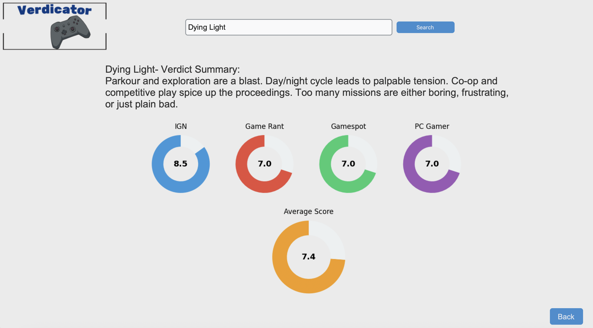

# Verdicator
Verdicator scrapes verdicts and ratings from multiple gaming websites, builds a local database, and visualizes the data in a clean GUI.

## Features:
 - Scrapes and aggregates critic scores.
 - Summarizes review texts into concise verdicts.
 - Visualizes data in an interactive GUI.

## Data Sources:
 - IGN  
 - Gamespot  
 - Game Rant  
 - PC Gamer  
 
 ## Technologies Used 🛠️
 - Python & Pandas for data processing and ETL
 - Selenium & BeautifulSoup for web scraping
 - customtkinter for GUI
 - SQLite for local database
 
 ## Usage:
 ### Check Out the Database:
 You can take a look at the gathered data on Kaggle:
 
 ### Run the app!
 Run "Verdicator.py" and enjoy.
 
 
 ## Images:
 
 
